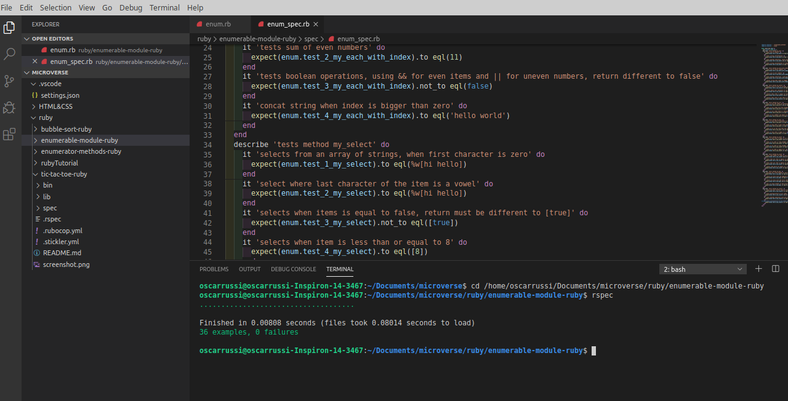

# enumerable-module-ruby test

Eight Ruby Microverse Project By Oscar Russi

# enumerable-module-ruby test

Eight Microverse project for Ruby Course

# What it does

- test the methods with 4 examples for each method.
- the methods pass all the tests.

## Built With

- Ruby

#### and deployed to GitHub

## Live Demo

[Live Demo](https://repl.it/@yoxter3423/enumerable-module-ruby-1)

## Authors

**Oscar Russi**
- Github: [@andresporras3423](https://github.com/andresporras3423/)
- Linkedin: [Oscar Russi](https://www.linkedin.com/in/oscar-andr%C3%A9s-russi-porras-053236167/)

**Ángel Cussi**
- Github: [@profile](https://github.com/abcussi)
- Twitter: [@profile](https://twitter.com/thecussi)
- Linkedin: [profile](https://www.linkedin.com/in/angel-cussi-1b2310174/)

## 🤝 Contributing

This is a project for educational purposes only. We are not accepting contributions.

## Attributions and Credit

Special thanks to Microverse, for this learning opportunity. 

## Show your support

Give a ⭐️ if you like this project!

## Enjoy!
